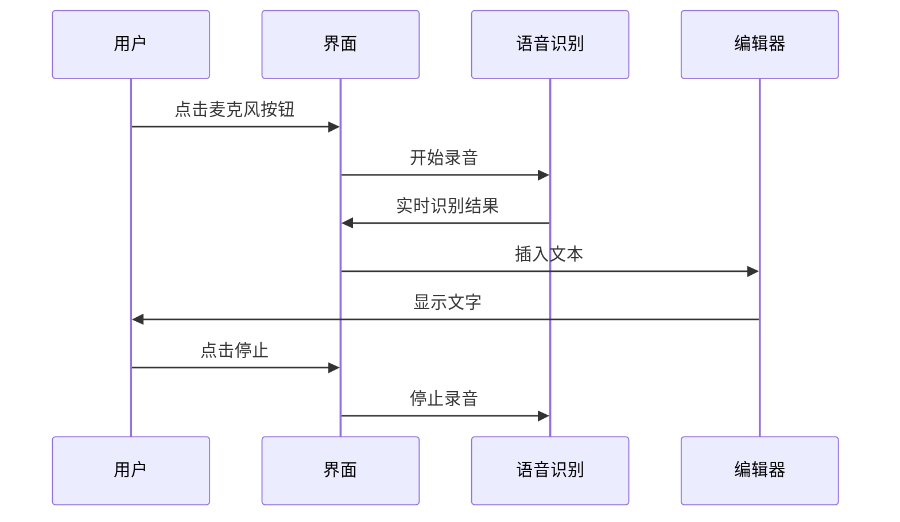
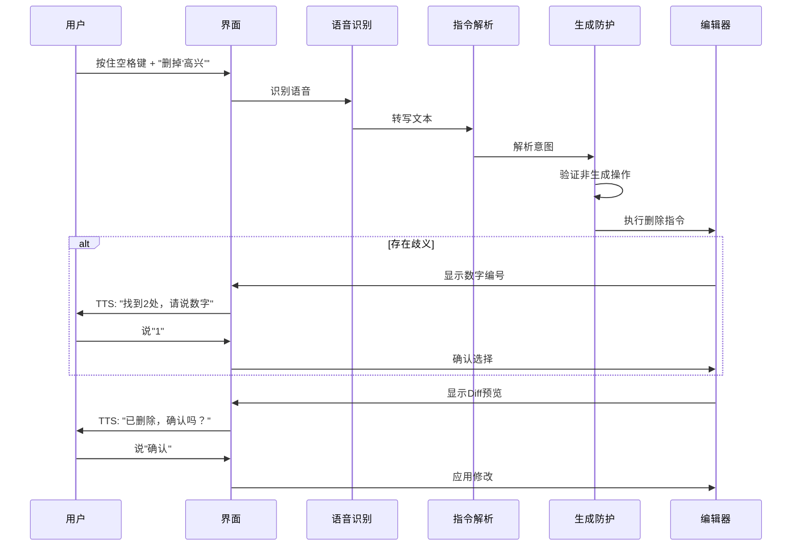

# 整体项目计划：小学生语音写作效率工具

## 1. 项目概述

### 1.1 核心定位

面向小学生的**纯效率工具**，通过语音技术消除物理书写障碍，帮助孩子将口语表达快速转化为书面文字，解决"想得出写不出"的效率问题。

### 1.2 核心原则

- **非生成式**：严格禁止 AI 生成内容，只做转录和编辑指令解析
- **纯效率工具**：不提供教学引导、建议或评分功能
- **语音优先**：全语音交互，参考 Serenade.ai 和 iOS Voice Control 的交互模式
- **隐私优先**：优先考虑本地部署，保护未成年人数据

### 1.3 目标用户

- 主要用户：小学生（2-6 年级）
- 使用场景：家庭作业、作文草稿录入
- 痛点：手写速度慢（10-15 字/分钟），草稿修改麻烦

## 2. 技术架构

### 2.1 技术栈

**前端：**

- React 18+ with TypeScript
- Tiptap（无头编辑器框架，基于 ProseMirror）
- Vite（构建工具）

**语音识别（ASR）：**

- **核心方案**：RealtimeSTT（本地 Python 服务，基于 Faster-Whisper + VAD）
- **通信协议**：WebSocket (Float32 PCM Stream)
- **备选**：Whisper WASM（纯前端方案，仅作为无法安装 Python 环境时的降级）

**自然语言理解（NLU）：**

- 轻量级 LLM：Qwen-1.8B / Phi-3（4-bit 量化，本地部署）
- 仅用于指令解析，禁止内容生成

**语音合成（TTS，可选）：**

- 用于反馈确认（"找到 2 处，请说数字"）
- 本地 TTS 引擎或轻量级云端 API

### 2.2 系统架构图

详见 [系统架构文档](../architecture.md)

## 3. 功能模块

### 3.1 阶段一：文字转录（当前计划）

**目标：** 实现语音转文字的基础功能

**功能清单：**

- [ ] Python 本地服务搭建 (FastAPI + RealtimeSTT)
- [ ] 前端 AudioWorklet 音频流处理
- [ ] WebSocket 双向通信
- [ ] Tiptap 编辑器基础配置
- [ ] 实时转录与更正 (Growing Buffer 机制)
- [ ] 幽灵文字 (Ghost Text) 装饰器实现
- [ ] 基础 UI（麦克风按钮、状态指示）

**技术方案：**

- 采用 Client-Server 架构 (Localhost)
- 利用 RealtimeSTT 的 VAD 和实时重转写能力

**时间估算：** 2-3 个工作日

**详细计划：** 见 [plan-step1-transcription.md](plan-step1-transcription.md)

### 3.2 阶段一优化：体验打磨与打包

**目标：** 降低本地 Python 服务的启动门槛，优化启动体验

**功能清单：**

- [ ] 一键启动脚本优化 (start.sh / start.bat)
- [ ] 错误边界处理 (服务未启动时的友好提示)
- [ ] 延迟优化 (AudioWorklet 降采样调优)
- [ ] (可选) 使用 PyInstaller 打包后端服务

**技术方案：**

- 脚本自动化
- 前端连接状态管理

**优势：**

- ✅ 提升易用性
- ✅ 减少环境配置问题

**时间估算：** 2-3 个工作日

**注意：** 由于 Phase 1 已采用 RealtimeSTT，原计划的 VAD 集成已内置，本阶段转为工程化优化。

### 3.3 阶段二：语音编辑基础

**目标：** 实现简单的语音修改指令

**功能清单：**

- [ ] Push-to-Talk 模式切换（按住空格键进入编辑模式）
- [ ] 基础指令识别：
  - "删除" / "删掉 XXX"
  - "替换 XXX 为 YYY"
  - "换行" / "句号" / "逗号"
- [ ] 规则引擎（正则匹配，不依赖 LLM）
- [ ] 简单的 Diff 预览

**技术方案：**

- 使用正则表达式匹配常见指令
- 避免引入 LLM，降低复杂度

**时间估算：** 3-5 个工作日

### 3.4 阶段三：智能指令解析

**目标：** 引入轻量级 LLM 实现自然语言指令理解

**功能清单：**

- [ ] 轻量级 LLM 本地部署（Qwen-1.8B 量化版）
- [ ] 指令解析架构：
  - Function Calling Schema 定义
  - 意图分类（insert/delete/replace/move）
  - 参数提取
- [ ] 生成防护机制：
  - System Prompt 约束
  - 运行时内容验证
  - 拒绝生成请求
- [ ] 数字编号选择机制（类似 iOS Voice Control）
- [ ] Diff 预览和确认流程

**技术细节：**

```typescript
// 指令解析Schema
interface EditIntent {
  operation: "insert" | "delete" | "replace" | "move";
  target: string; // 目标文本或位置
  content?: string; // 替换内容（仅replace时）
  scope: "word" | "sentence" | "paragraph" | "all";
}

// 生成防护
const SYSTEM_PROMPT = `
你是一个文档编辑指令解析器，只能理解修改意图，绝不能生成内容。
禁止操作：generate, rewrite, expand, summarize
`;
```

**时间估算：** 5-7 个工作日

### 3.5 阶段四：去口语化处理

**目标：** 智能过滤口语中的非流利成分

**功能清单：**

- [ ] 填充词过滤（"那个"、"然后"、"就是"）
- [ ] 重复修正识别（"蓝色的，不对，红色的" → "红色的"）
- [ ] 语法错误保留（仅标记，不自动修正）
- [ ] 可配置的过滤规则

**技术方案：**

- 规则引擎 + 轻量级 LLM 辅助判断
- 区分"修正意图"和"语法错误"

**时间估算：** 3-4 个工作日

### 3.6 阶段五：标点与格式自动化

**目标：** 自动处理标点和段落格式

**功能清单：**

- [ ] 基于停顿自动添加标点
- [ ] 语调识别（问句、感叹句）
- [ ] 自动分段（长停顿识别）
- [ ] 格式指令支持（"标题"、"加粗"等）

**时间估算：** 2-3 个工作日

### 3.7 阶段六：高级交互优化

**目标：** 完善用户体验和性能优化

**功能清单：**

- [ ] 同音字可视化选择（图标选择，非文字列表）
- [ ] 语音反馈（TTS 确认操作）
- [ ] 撤销/重做优化
- [ ] 长文档性能优化
- [ ] 离线模式支持

**时间估算：** 4-5 个工作日

### 3.7 阶段七：ASR 升级（可选）

**目标：** 提升语音识别准确率

**功能清单：**

- [ ] Whisper WASM 集成
- [ ] 模型量化优化（平衡准确率和性能）
- [ ] 儿童语音数据集微调（可选）
- [ ] 云端 API 备选方案

**时间估算：** 5-7 个工作日

### 3.8 阶段八：Native 应用（未来）

**目标：** 考虑开发原生应用以提升性能

**可选方案：**

- **React Native**：跨平台，代码复用
- **Electron**：桌面应用，易于部署
- **原生开发**：iOS/Android，最佳性能

**考虑因素：**

- 性能需求（是否需要原生性能）
- 部署复杂度
- 用户体验差异

## 4. 核心交互流程

### 4.1 文字录入流程



### 4.2 语音编辑流程（阶段三）



### 4.3 数字编号选择机制

**设计参考：** iOS Voice Control

**实现方式：**

1. 检测到歧义（如多个匹配项）
2. 在文本上显示数字标签（1、2、3...）
3. TTS 语音提示："找到 3 处，请说数字"
4. 用户说出数字选择
5. 高亮对应项，等待确认

**UI 示例：**

```
今天天气很好 [1]，我去公园玩了
昨天天气也很好 [2]，我在家里
```

## 5. 技术难点与解决方案

### 5.1 歧义处理

**问题：** "把'他'改成'小明'"——如果文中有多个"他"？

**解决方案：**

- 数字编号选择机制（参考 iOS Voice Control）
- 最近优先原则（优先选择光标附近）
- 上下文语义分析（LLM 辅助判断）

### 5.2 延迟优化

**问题：** LLM 推理延迟（100-300ms）+ ASR 延迟（200ms）= 总延迟可能超过 500ms

**解决方案：**

- 乐观 UI 更新（先显示临时结果）
- 本地轻量级 LLM（避免网络延迟）
- 规则引擎旁路（常见指令不走 LLM）

### 5.3 生成防护

**问题：** 如何确保 LLM 不会生成内容？

**解决方案（三层防护）：**

1. **System Prompt 约束**：明确禁止生成
2. **Function Calling Schema 限制**：只允许编辑操作
3. **运行时验证**：检查输出内容是否在原始语音中出现

### 5.4 中文语音识别准确率

**问题：** 儿童语音 + 中文 = 识别准确率挑战

**解决方案：**

- 儿童语音数据集微调（可选）
- 多 ASR 源交叉验证
- 用户主动纠错机制（拼音提示）

## 6. 开发路线图

### 6.1 MVP 阶段（当前）

**时间：** 2-3 周

**交付物：**

- [x] 基础语音转录功能
- [ ] 简单语音编辑（规则引擎）
- [ ] 可用性测试

**目标：** 验证核心交互流程是否可行

### 6.2 Alpha 版本

**时间：** 1-2 个月

**交付物：**

- [ ] 智能指令解析（LLM）
- [ ] 数字编号选择
- [ ] 基础去口语化
- [ ] 完整 UI 设计

**目标：** 核心功能完整，可以实际使用

### 6.3 Beta 版本

**时间：** 2-3 个月

**交付物：**

- [ ] ASR 升级（Whisper WASM）
- [ ] 性能优化
- [ ] 错误处理完善
- [ ] 用户体验优化

**目标：** 稳定可用，准备正式发布

### 6.4 1.0 版本

**时间：** 3-4 个月

**交付物：**

- [ ] 完整的文档
- [ ] 用户指南
- [ ] 性能优化
- [ ] 可选：Native 应用

**目标：** 正式发布

## 7. 技术选型对比

### 7.1 ASR 方案对比

| 方案                   | 准确率 | 延迟 | 隐私 | 成本 | 推荐阶段            |
| ---------------------- | ------ | ---- | ---- | ---- | ------------------- |
| RealtimeSTT (本地服务) | 很高   | 低   | 高   | 免费 | **第一阶段 (已选)** |
| Whisper WASM（纯前端） | 高     | 中   | 高   | 免费 | 备选/降级方案       |
| 云端 API               | 很高   | 中   | 低   | 付费 | 不推荐（隐私问题）  |

### 7.2 LLM 方案对比

| 方案             | 性能 | 延迟 | 隐私 | 成本 | 推荐阶段 |
| ---------------- | ---- | ---- | ---- | ---- | -------- |
| Qwen-1.8B (本地) | 中   | 低   | 高   | 免费 | Alpha+   |
| GPT-4o (API)     | 很高 | 高   | 低   | 付费 | 不推荐   |
| DeepSeek API     | 高   | 中   | 低   | 低   | 备选     |

### 7.3 编辑器方案对比

| 方案     | 灵活性 | 性能 | 学习曲线 | 推荐        |
| -------- | ------ | ---- | -------- | ----------- |
| Tiptap   | 很高   | 高   | 中       | ✅ 已选     |
| Draft.js | 中     | 中   | 低       | ❌ 功能不足 |
| Slate    | 高     | 高   | 高       | ❌ 复杂度高 |

## 8. 风险与应对

### 8.1 技术风险

| 风险                        | 影响 | 应对策略                        |
| --------------------------- | ---- | ------------------------------- |
| 模型加载时间长              | 中   | 模型缓存、进度提示、CDN 加速    |
| 轻量级 LLM 指令解析能力不足 | 高   | 先用规则引擎，LLM 作为增强      |
| Tiptap 集成复杂度超预期     | 中   | 参考官方示例，分步实现          |
| 固定分块导致延迟不可控      | 中   | 第一步先验证，后续添加 VAD 优化 |
| 性能问题（长文档）          | 低   | 虚拟滚动、Web Worker 处理       |

### 8.2 产品风险

| 风险               | 影响 | 应对策略                   |
| ------------------ | ---- | -------------------------- |
| 孩子不习惯语音交互 | 高   | 简单引导，降低学习成本     |
| 家长担心"提笔忘字" | 中   | 强调是草稿工具，最终需誊抄 |
| 误操作频繁         | 中   | 完善的撤销机制，确认流程   |

### 8.3 合规风险

| 风险         | 影响 | 应对策略                   |
| ------------ | ---- | -------------------------- |
| 儿童数据隐私 | 高   | 本地优先，数据不出设备     |
| 教育政策限制 | 中   | 定位为效率工具，非教学工具 |

## 9. 成功指标

### 9.1 功能指标

- 语音识别准确率 > 90%（针对儿童语音）
- 指令解析准确率 > 85%
- 端到端延迟 < 500ms（P95）

### 9.2 用户体验指标

- 完成一篇 300 字作文时间 < 15 分钟（vs 传统手写 1-2 小时）
- 用户满意度 > 4.0/5.0
- 学习曲线 < 5 分钟（首次使用）

### 9.3 技术指标

- 页面加载时间 < 2 秒
- 内存占用 < 200MB（长时间使用）
- 浏览器兼容性：Chrome、Edge、Safari（iOS 14.5+）

## 10. 参考资料

### 10.1 技术文档

- [Tiptap 官方文档](https://tiptap.dev/)
- [Web Speech API MDN](https://developer.mozilla.org/en-US/docs/Web/API/Web_Speech_API)
- [Whisper WASM](https://github.com/ggerganov/whisper.cpp)
- [Qwen 模型](https://github.com/QwenLM/Qwen)

### 10.2 设计参考

- [Serenade.ai 交互模式](https://serenade.ai/)
- [iOS Voice Control](https://support.apple.com/guide/iphone/use-voice-control-iph2c21a3c88/ios)
- [Tiptap Voice Control Demo](https://www.youtube.com/watch?v=FYETnU-RhyA)

### 10.3 项目文档

- [第一步实施计划](plan-step1-transcription.md)
