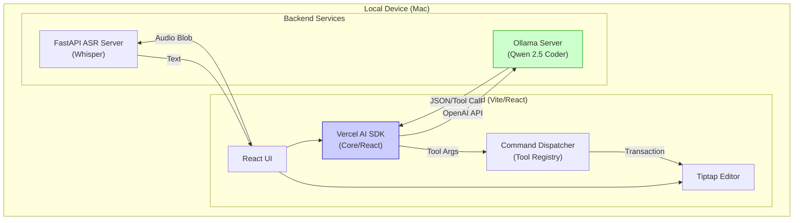

# 系统架构

## 架构图

```mermaid
graph TB
    subgraph "Local Device (Mac)"
        subgraph "Frontend (Vite/React)"
            UI["React UI"]
            Editor["Tiptap Editor"]
            VercelSDK["Vercel AI SDK<br/>(Core/React)"]
            CommandDispatcher["Command Dispatcher<br/>(Tool Registry)"]
        end

        subgraph "Backend Services"
            ASR_Service["FastAPI ASR Server<br/>(Whisper)"]
            Ollama_Service["Ollama Server<br/>(Qwen 2.5 Coder)"]
        end
    end

    UI --> Editor
    UI --> VercelSDK

    %% Audio Flow
    UI -->|Audio Blob| ASR_Service
    ASR_Service -->|Text| UI

    %% Intelligence Flow
    VercelSDK -->|OpenAI API| Ollama_Service
    Ollama_Service -->|JSON/Tool Call| VercelSDK
    VercelSDK -->|Tool Args| CommandDispatcher
    CommandDispatcher -->|Transaction| Editor

    style Ollama_Service fill:#ccffcc,stroke:#009900
    style VercelSDK fill:#ccccff,stroke:#000099
```
