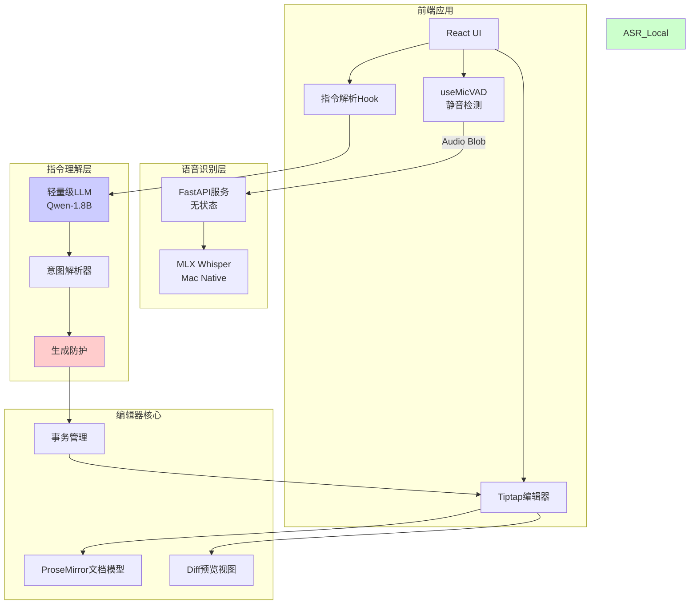

# 系统架构

## 架构图

```mermaid
graph TB
    subgraph "前端应用"
        UI[React UI]
        Editor[Tiptap编辑器]
        VoiceHook[useMicVAD<br/>静音检测]
        NLUHook[指令解析Hook]
    end

    subgraph "语音识别层"
        ASR_Service[FastAPI服务<br/>无状态]
        MLX_Engine[MLX Whisper<br/>Mac Native]
    end

    subgraph "指令理解层"
        LLM[轻量级LLM<br/>Qwen-1.8B]
        IntentParser[意图解析器]
        Guard[生成防护]
    end

    subgraph "编辑器核心"
        ProseMirror[ProseMirror文档模型]
        Transaction[事务管理]
        DiffView[Diff预览视图]
    end

    UI --> Editor
    UI --> VoiceHook
    VoiceHook -->|Audio Blob| ASR_Service
    ASR_Service --> MLX_Engine

    UI --> NLUHook
    NLUHook --> LLM
    LLM --> IntentParser
    IntentParser --> Guard
    Guard --> Transaction
    Transaction --> Editor

    Editor --> ProseMirror
    Editor --> DiffView

    style Guard fill:#ffcccc
    style ASR_Local fill:#ccffcc
    style LLM fill:#ccccff
```
